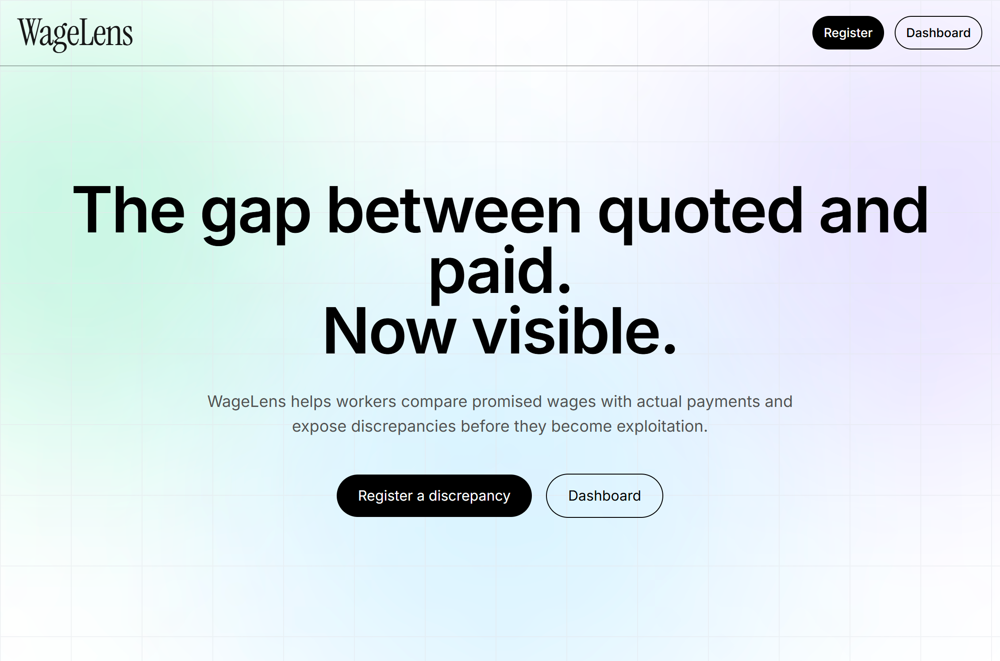
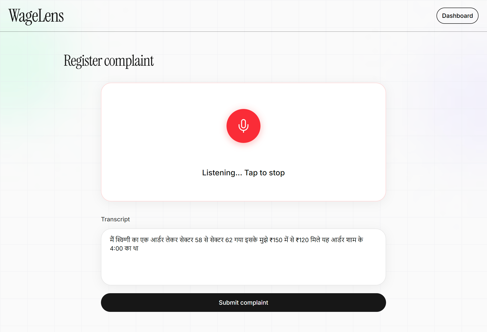
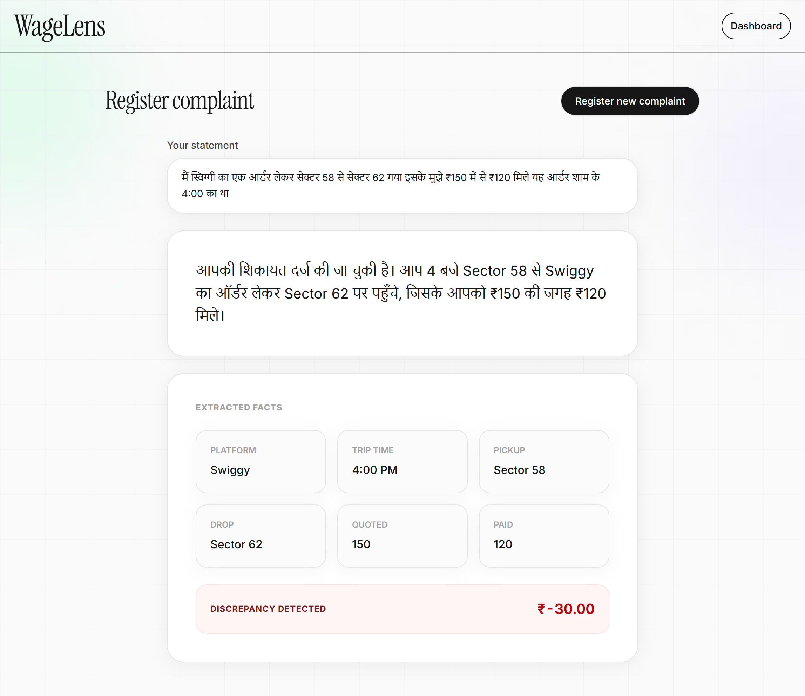
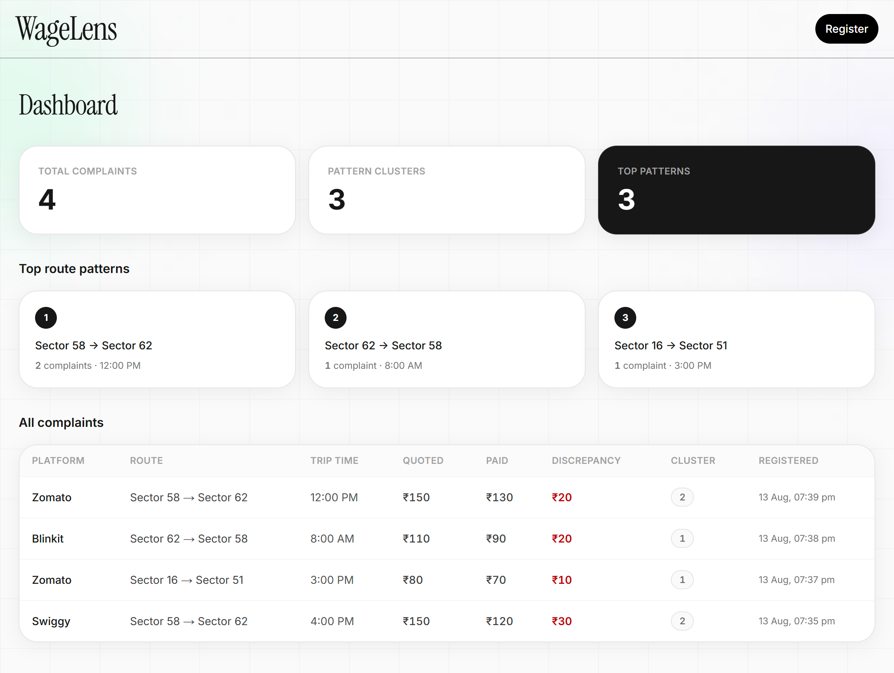

# WageLens

Voice-first wage discrepancy reporting for gig workers. Drivers speak (or type) complaints in Hindi; the backend extracts trip facts, detects recurring route patterns, and returns spoken feedback.

## Screenshots

| | |
| :---: | :---: |
| **Landing page**   | **Register complaint**   |
| **Complaint registered**   | **Dashboard**   |

## Presentation

### [Presentation File (.pptx)](assets/presentation/WageLens.pptx)

## Stack

- **Frontend** — Next.js 16, React 19, Tailwind CSS 4, browser speech recognition
- **Backend** — FastAPI, CrewAI agents, SQLite, Qdrant (pattern clustering), Rime TTS

## Prerequisites

- Node.js 20+
- Python 3.12+ with [uv](https://docs.astral.sh/uv/)
- Docker (for Qdrant)
- API keys: OpenAI (or OpenRouter), Rime, Hugging Face (for embeddings)

## Run locally

Follow the setup guides for each service:

- **[Backend](backend/README.md)** — Qdrant, FastAPI, CrewAI pipeline
- **[Frontend](frontend/README.md)** — Next.js app

API: `http://localhost:8080` · App: `http://localhost:3000`

## Main routes

| Route | Purpose |
|-------|---------|
| `/` | Landing page |
| `/complaints/new` | Register a complaint (voice or text) |
| `/dashboard` | Complaint stats and pattern clusters |
